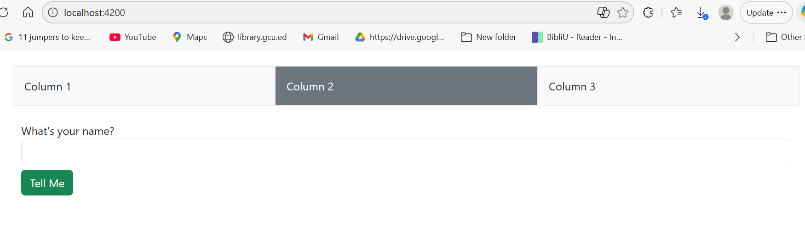
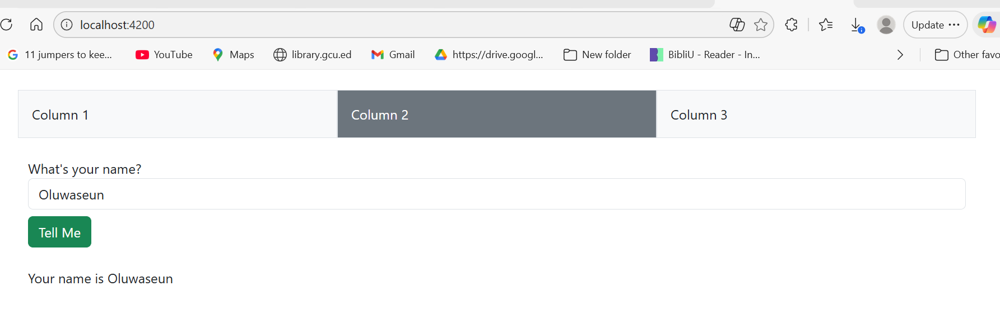
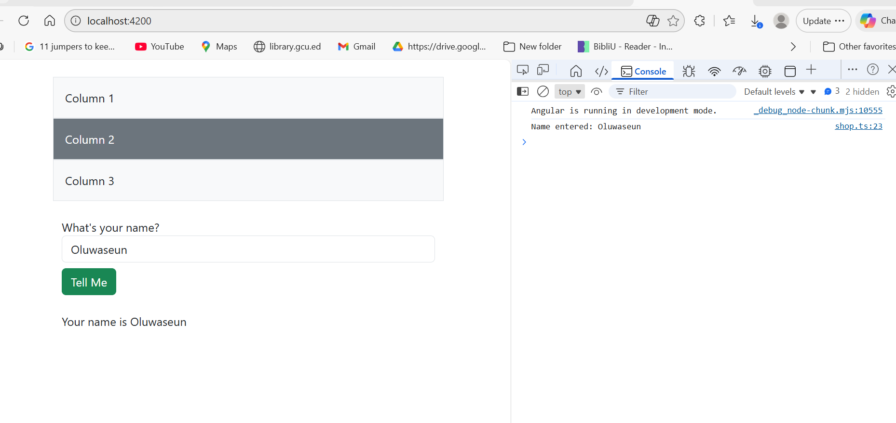
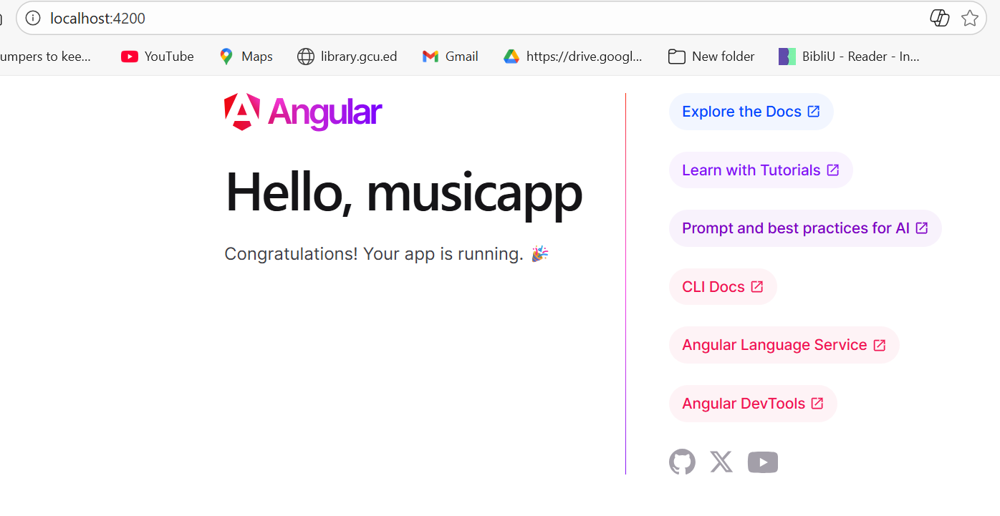
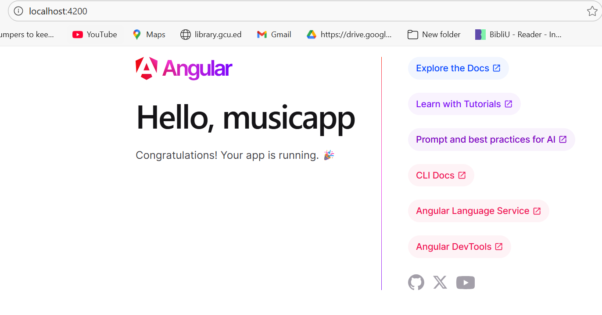
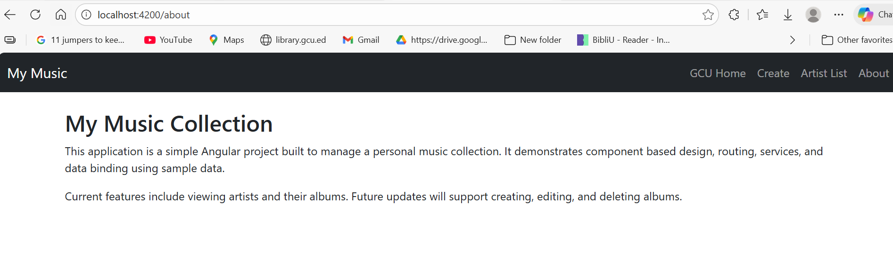
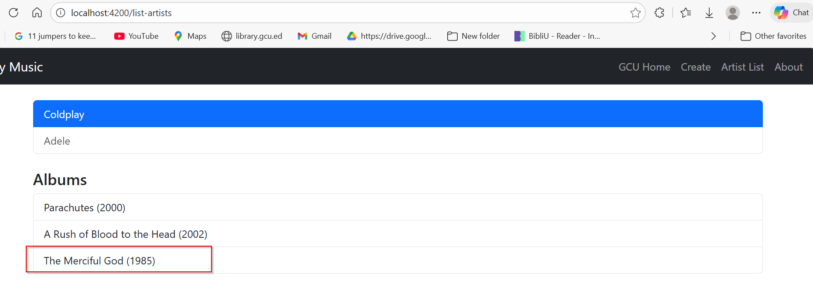
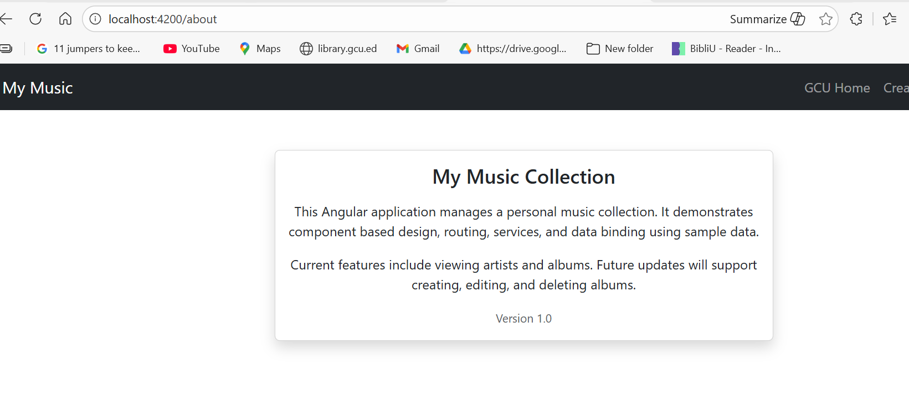

# CST 391 Activity 3 Part 1
## Angular Components, Forms, and Responsive Layout

## Overview

This activity demonstrates the use of Angular standalone components, Bootstrap for responsive layout, reactive forms, event handling, data binding, and console logging. The application was developed using a browser based Angular configuration and runs locally using the Angular development server.
- Responsive layout using Bootstrap
- Component creation
- Event handling
- Data binding
- Reactive and template driven forms
- Passing data between components

## Project Structure
The Angular application is located in the following directory:
activities/activity3/simpleapp


- `simpleapp/`  
  Angular application created using Angular CLI.

## Running the Application

Navigate into the Angular app folder and run:

```bash
cd simpleapp
npm install
ng serve
```

## Application Running

The following screenshot shows the Angular application successfully running on the local development server.


## Angular Application Running

The following screenshot confirms that the Angular application runs successfully after updating the angular.json configuration and restarting the development server.


## Responsive Bootstrap Grid

The following screenshots demonstrate a responsive Bootstrap grid layout.

### Large Screen Layout


### Small Screen Layout


## Shop Component – Reactive Form

The Shop component demonstrates:

- Reactive forms

- Event handling

- Data binding

- Conditional rendering

## Angular Forms and Responsive Layout

---

## Shop Component – Reactive Form

The Shop component demonstrates the use of a reactive form, event handling, and data binding. The user enters a value into the form, submits it, and the result is displayed on the page.

---

### Before Form Submission

The screenshot below shows the Shop component before the form is submitted.



---

### After Form Submission

The screenshot below shows the Shop component after the form is submitted.  
The submitted value is displayed on the page using data binding.



---

## Console Output

The following screenshot confirms that submitting the form triggers a console log message, demonstrating successful event handling and logging.




## Technologies Used

- Angular (standalone components)

- Bootstrap

- TypeScript

- HTML and CSS

- Angular CLI

## Summary

This activity successfully demonstrates responsive design using Bootstrap, reactive form implementation, event handling, data binding, and console logging within an Angular application. The application runs without errors and meets all requirements outlined for CST 391 Activity 3.


## Research

### 1. `@Input` Decorator in `info.component.ts`

The `@Input` decorator in Angular is used to allow data to be passed from a parent component to a child component. In `info.component.ts`, it enables the Info component to receive values such as a name or message that originate from another component. This supports component communication while keeping components modular and reusable. Without the `@Input` decorator, the child component would not be able to receive external data directly from its parent.

---

### 2. `[value]` in `info.component.html`

The `[value]` syntax in `info.component.html` is an example of property binding in Angular. It binds a value from the component’s TypeScript file to the value property of an HTML element. This ensures that the displayed value in the input field is always synchronized with the component data. Property binding allows Angular to dynamically update the DOM instead of relying on static HTML values.

---

### 3. `[(ngModel)]` in `info.component.html`

The `[(ngModel)]` directive provides two way data binding in Angular. It allows data to flow from the component to the view and from the view back to the component automatically. When a user types into an input field, the bound variable in the component updates immediately, and when the variable changes in the component, the view updates as well. This approach simplifies handling user input and is commonly used in template driven forms.

# CST-391 Activity 3 – Music Application (Part 2)
## Front-End Development with Angular

---

## Overview

This project is the front-end portion of the **Music Application** developed for CST-391 Activity 3.  
The goal of Part 2 is to build a structured Angular application that uses multiple components, routing, event handling, and data binding, while preparing the application to later connect to a Music API.

For this activity, mocked JSON data is used to simulate real music data and support UI development. All data is managed through a shared Music Service and rendered dynamically using Angular standalone components. 

---

## Executive Summary

In this phase of the project, an Angular application named **musicapp** was created using Angular’s modern standalone component structure. Bootstrap was integrated to provide a responsive and professional user interface.

The application establishes the foundational structure required for future milestones, including routing, component communication, and service-based data access. This phase focuses on correctness, structure, and preparation rather than full feature completion.

---

## Application Setup

The application was created with routing enabled and Bootstrap added for UI styling.

Key setup items include:
- Angular standalone components
- Bootstrap CSS and JavaScript integration
- Development server configuration
- Project structure aligned with course instructions

---

## Implemented Features

- Artist List with dynamic album display  
- Create Album form with image support  
- Automatic refresh of artist albums after creation  
- About page displayed as an About Box  
- Navigation bar linking all pages  
- Image rendering using Angular assets folder  

---

## Initial Application View

The following screenshot shows the initial application running locally after setup.

### Initial Application Page




## Bootstrap Integration

Bootstrap was successfully added to the application through the `angular.json` configuration file. This allows consistent styling and interactive UI elements to function correctly.

### Bootstrap Layout Example




## Form Interaction and Data Binding

A simple form was implemented to demonstrate:
- Event handling
- Data binding
- Console logging

# CST-391 Activity 3 — Part 2  
## My Music Collection

This section of the project focuses on updating the application layout, configuring navigation, and wiring routing views using Angular standalone components.

The goal of Part 2 was to clean the default Angular view, add a Bootstrap navigation bar, and ensure routed components display correctly.

---

## 🔧 Changes Implemented

### 1. Cleaned Default Angular View
- Removed the default Angular welcome content from `app.html`
- Left only the `router-outlet` so routed components control the view
- Updated the application title to **My Music**

---

### 2. Bootstrap Navigation Bar
A Bootstrap navbar was added to provide consistent navigation across the application.

The navigation bar includes:
- **Brand:** My Music
- **GCU Home:** External link to https://www.gcu.edu
- **Create:** Routes to the Create Album view
- **Artist List:** Routes to the artist listing
- **About:** Displays application information

Navigation uses Angular `routerLink` instead of traditional `href` attributes.

---

### 3. Routing Configuration
Routes were defined in `app.routes.ts` to support navigation:

| Route | Component |
|------|----------|
| `/list-artists` | Artist list |
| `/create` | Create Album |
| `/about` | About page |
| `/display/:id` | Album display (future) |
| `/edit/artist/:id` | Edit album (future) |
| `/delete/artist/:id` | Delete album (future) |

The default route redirects to `/list-artists`.

---

### 4. About Page
An About component was created to display a short description of the application.

The About page explains:
- The purpose of the project
- Technologies used
- Current and future features

---

## 🖥️ Screenshots


### About Page Rendered via Routing


---

###  GCU Homepage
This screenshot shows one of the navigation bar components used in the application, providing access to the main menu and branding elements.


## 🛠️ Technologies Used

- Angular (Standalone Components)
- TypeScript
- HTML & CSS
- Bootstrap
- Visual Studio Code

---

### Create Album – Added Album

This screen shows the Create Album form and a successfully added album.  
The album data is stored in the Music Service and becomes immediately available under the selected artist.



---

### About Box

The About page is implemented as an About Box that provides a brief description of the application and its purpose.



---

## Technical Notes

- Images are stored in the `src/assets` directory and referenced using relative paths.
- The Artist List automatically refreshes because all components share the same Music Service instance.
- Album images render correctly when valid image URLs or asset paths are provided.
- Navigation is handled using Angular Router.

---

## Research Component

The `music-service.service.ts` file is fully commented and explains the purpose of each method, including:

- Retrieving artists
- Creating albums
- Fetching albums by artist
- Managing in-memory application data


The fully commented Music Service code used for the research portion of this activity can be found below:

[Open Research Work](./src/data/Research-Work.txt)

---

## Conclusion

This activity demonstrates component communication, routing, form handling, and dynamic UI updates in Angular.  
The application fulfills all required deliverables and prepares the foundation for future enhancements such as editing and deleting albums.

---


