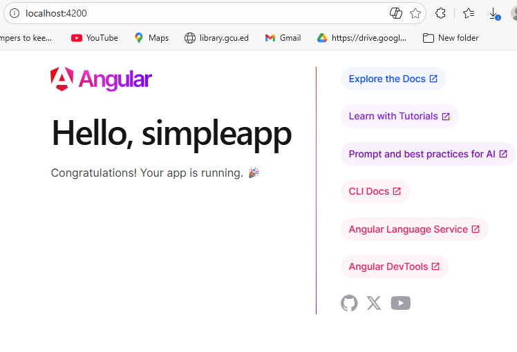
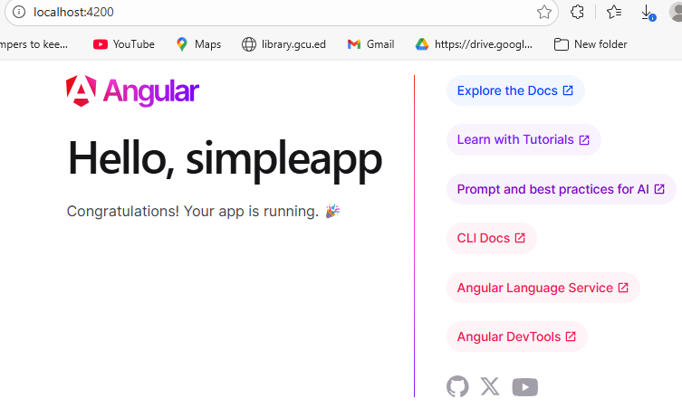
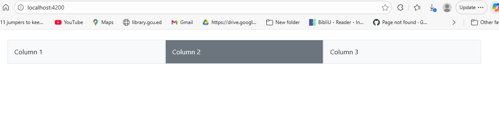
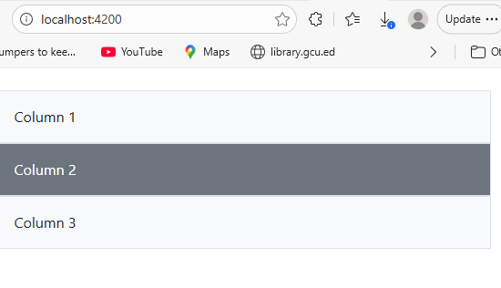

# CST 391 Activity 3
## Angular Components, Forms, and Responsive Layout

## Overview

This activity demonstrates the use of Angular standalone components, Bootstrap for responsive layout, reactive forms, event handling, data binding, and console logging. The application was developed using a browser based Angular configuration and runs locally using the Angular development server.
- Responsive layout using Bootstrap
- Component creation
- Event handling
- Data binding
- Reactive and template driven forms
- Passing data between components

## Project Structure

- `simpleapp/`  
  Angular application created using Angular CLI.

## Running the Application

Navigate into the Angular app folder and run:

```bash
cd simpleapp
npm install
ng serve
```

## Application Running

The following screenshot shows the Angular application successfully running on the local development server.



## Angular Application Running

The following screenshot confirms that the Angular application runs successfully after updating the angular.json configuration and restarting the development server.



## Responsive Bootstrap Grid

The following screenshots demonstrate a responsive Bootstrap grid layout.

### Large Screen Layout


### Small Screen Layout

