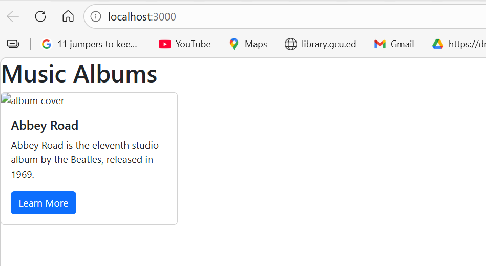
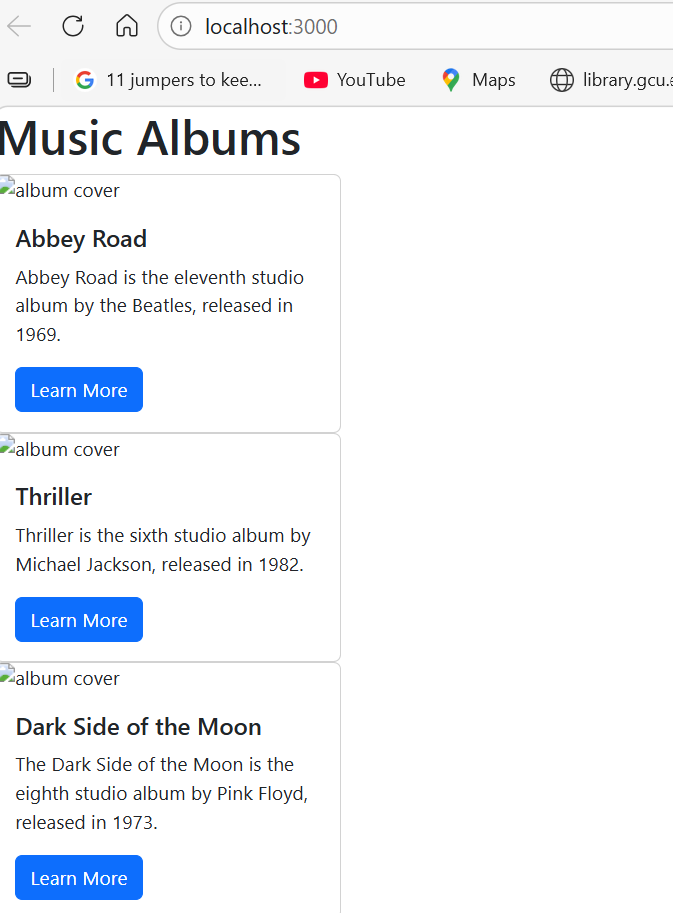
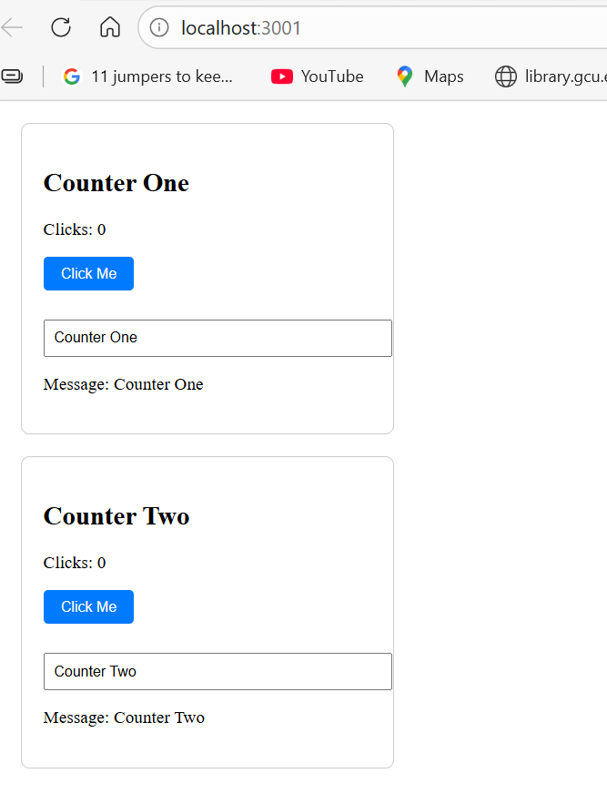
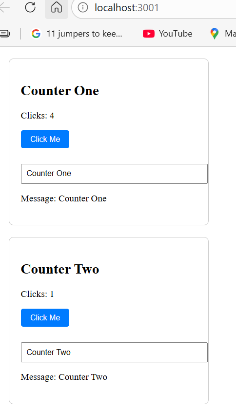
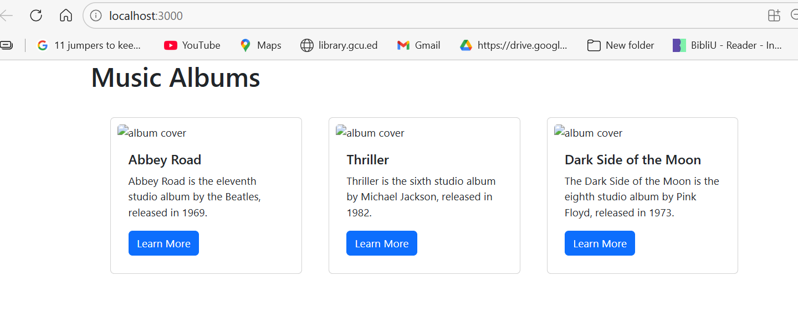

# CST-391 Activity 5 - React Music App & State Changer Demo

**Name:** Oluwaseun Akerele  
**Course:** CST-391  
**Activity:** 5  

---

## Table of Contents
- [Part 1 - Music App with Custom Components](#part-1---music-app-with-custom-components)
- [Part 2 - State Changer Mini App](#part-2---state-changer-mini-app)
- [Part 3 - Music App with State and Props](#part-3---music-app-with-state-and-props)
- [Summary](#summary)

---

## Part 1 - Music App with Custom Components

### Executive Summary
In this part, I created a React music app using custom components, props, and Bootstrap. A **component** is a reusable piece of UI code that can be used multiple times throughout the application. **Props** are values passed from a parent component to a child component, similar to function parameters in a conventional programming language. **JSX** is JavaScript that looks like HTML and is unique to React. Instead of copying and pasting card HTML repeatedly, I created a reusable `Card` component that accepts props for the album title, description, button text, and image URL. Bootstrap was imported via CDN in `index.html` to style the cards.

### Screenshot 1 - Single Card View
  


### Screenshot 2 - Three Cards Stacked Vertically
  


---

## Part 2 - State Changer Mini App

### Executive Summary
In this part, I built a separate mini app to demonstrate React **state** using the `useState` hook. State is different from props — state is managed inside the component and can change dynamically based on user interaction, while props come from the parent and are read-only. The `useState` hook returns the current state value and a function to update it. Each `Counter` component independently tracks its own click count and text message state. Updating state triggers a re-render of the component, which is how the UI updates in React.

### Screenshot 3 - Counter App at 0 Clicks
  


### Screenshot 4 - Counter App After Clicking
  


---

## Part 3 - Music App with State and Props

### Summary
In this part, I returned to the music app and applied what I learned about state, props, and the `map()` function. The album data was moved into a `useState` array called `albumList`. The **map() function** is a transformation function that iterates over each element of an array and returns a new array — in this case, transforming album data objects into JSX `Card` components. **CSS FlexBox** was applied via `App.css` to display the cards horizontally side by side instead of stacked vertically.

### Screenshot 5 - Three Cards Displayed Horizontally
  


---

## Summary

### New Terminology

| Term | Definition |
|------|-----------|
| **Component** | A reusable, self-contained piece of UI in React |
| **Props** | Read-only values passed from a parent component to a child component |
| **State** | Dynamic values managed inside a component that trigger re-renders when changed |
| **JSX** | JavaScript syntax that looks like HTML, used to describe UI in React |
| **useState** | A React hook that adds state management to functional components |
| **map()** | A JavaScript array function that transforms each element into a new value |
| **FlexBox** | A CSS layout system used to arrange elements horizontally or vertically |
| **Hook** | A special React function that lets functional components access React features like state |

---

## Project Structure

```
activity5/
  src/
    index.js       - Entry point, renders App to the DOM
    App.js         - Main component, holds albumList state and renders Cards
    Card.js        - Reusable card component that accepts props
    App.css        - FlexBox styling for horizontal card layout
  public/
    index.html     - HTML template with Bootstrap CDN link
  screenshots/
    single-card-view.png
    3cards-stacked-vertically.png
    3cards-stacked-horizontally.png
    countet-at-0clicks.png
    counter-after-clicking.png

statechanger/
  src/
    index.js       - Entry point
    App.js         - Renders two Counter components
    Counter.js     - Stateful component tracking clicks and message
    Counter.css    - Styling for the counter component
```

---

## How to Run

### Music App
```bash
cd activity5
npm install
npm start
```

### State Changer App
```bash
cd statechanger
npm install
npm start
```
