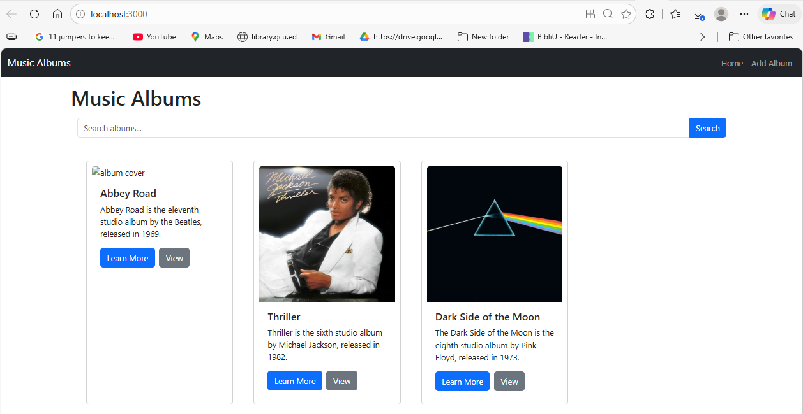
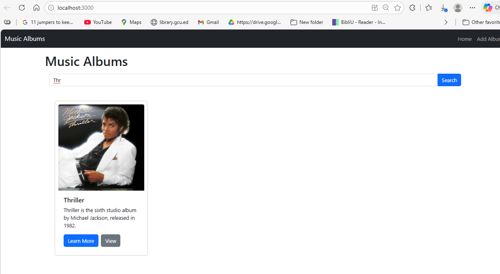
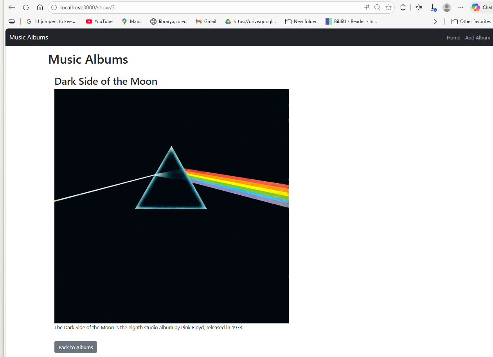
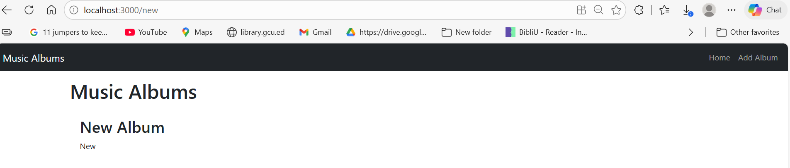
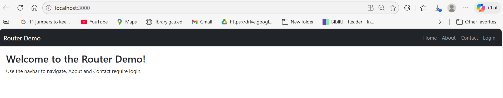
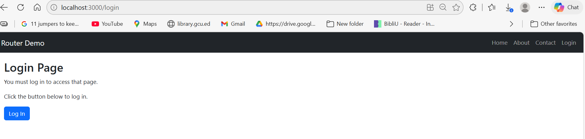
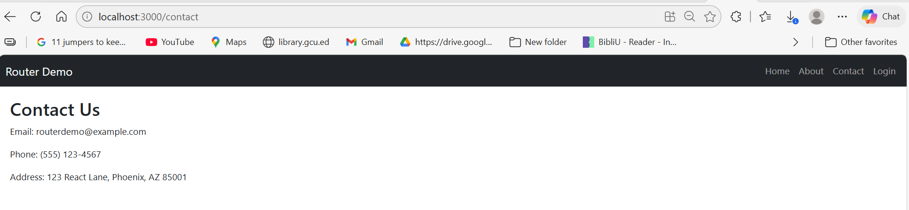
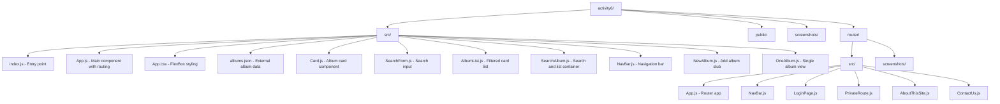

# CST-391 Activity 6 - External Data Sources & Routing

**Name:** Oluwaseun Akerele  
**Course:** CST-391  
**Activity:** 6  

---

## Table of Contents
- [Part 3 - External Data Source & Search](#part-3---external-data-source--search)
- [Mini App 2 - Routing Demo](#mini-app-2---routing-demo)
- [Part 4 - Navigation Routing in Music App](#part-4---navigation-routing-in-music-app)
- [Summary](#summary)

---

## Part 3 - External Data Source & Search

### Executive Summary
In this part, I moved the album data out of the component state and into an external JSON file. The `useEffect` hook was used to load the data into state when the component mounts. A `SearchForm` component was added to allow users to filter albums by description. The search feature uses a **callback function** to pass the search phrase from the child `SearchForm` component up to the parent, which then filters the album list using the JavaScript `filter()` method. **Axios** is a promise-based HTTP client library used to fetch data from REST APIs asynchronously. **useEffect** is a React hook that handles side effects like data loading and API calls during the component lifecycle.

### Screenshot 1 - Music App Home
  
*Figure 1: Music app showing the navbar, search bar, and three album cards displayed horizontally.*

### Screenshot 2 - Search Filtered Results
  
*Figure 2: Search feature filtering albums — searching "thriller" returns only the Thriller album.*

### Screenshot 3 - Single Album View
  
*Figure 3: Clicking the View button on a card routes to the single album detail page with a Back to Albums button.*

### Screenshot 4 - Add Album Stub
  
*Figure 4: The Add Album page is a stub component that will be developed in Activity 7.*

---

## Mini App 2 - Routing Demo

### Executive Summary
In this mini app, I demonstrated React Router by building a multi-page application with protected routes. **React Router** is a library that connects browser URLs to React components. **BrowserRouter** is the wrapper component that enables routing. **Routes** and **Route** define the individual paths. A **PrivateRoute** component protects pages from unauthorized access — if a user is not logged in and tries to access About or Contact, they are redirected to the Login page. The `useNavigate` hook allows programmatic navigation between routes, and `useLocation` is used to track where the user came from so they can be redirected back after login.

### Screenshot 5 - Router Home Page
  
*Figure 5: Home page of the Router Demo app with navbar links for Home, About, Contact, and Login.*

### Screenshot 6 - Login Page (Redirected)
  
*Figure 6: Clicking About or Contact redirects unauthorized users to the Login page.*

### Screenshot 7 - About Page (After Login)
  
*Figure 7: After clicking Log In, the user is redirected to the About This Site page.*

### Screenshot 8 - Contact Page
  
*Figure 8: Contact Us page showing company contact information, accessible after login.*

---

## Part 4 - Navigation Routing in Music App

### Summary
In this part, I refactored the music app to use React Router for navigation. The `renderedList` function was moved into a new `AlbumList` component, and a `SearchAlbum` component was created to contain both the `SearchForm` and `AlbumList`. `App.js` was updated to use `BrowserRouter`, `Routes`, and `Route` to define three routes: the home search page, the new album stub page, and the single album detail page. The `useNavigate` hook is used to programmatically navigate to the single album view when the View button is clicked. This refactoring follows React best practices by breaking the app into smaller, focused components.

---

## Summary

### New Terminology

| Term | Definition |
|------|-----------|
| **useEffect** | A React hook that runs side effects like data fetching after the component renders |
| **Axios** | A promise-based HTTP client library for fetching data from REST APIs |
| **async/await** | JavaScript syntax for writing asynchronous code that looks synchronous |
| **React Router** | A library that connects browser URLs to React components |
| **BrowserRouter** | The wrapper component that enables React Router in an application |
| **Route** | Defines a path and the component to render when that path is visited |
| **PrivateRoute** | A custom component that protects routes from unauthorized access |
| **useNavigate** | A React Router hook that allows programmatic navigation between routes |
| **useLocation** | A React Router hook that returns the current location object |
| **Callback Function** | A function passed as a prop from parent to child so the child can call it to pass data upward |
| **filter()** | A JavaScript array method that returns a new array with elements that pass a test |

---

## Project Structure



---

## How to Run

### Music App
```bash
cd activity6
npm install
npm start
# Runs at http://localhost:3000
```

### Router Mini App
```bash
cd activity6/router
npm install
npm start
# Runs at http://localhost:3001
```
