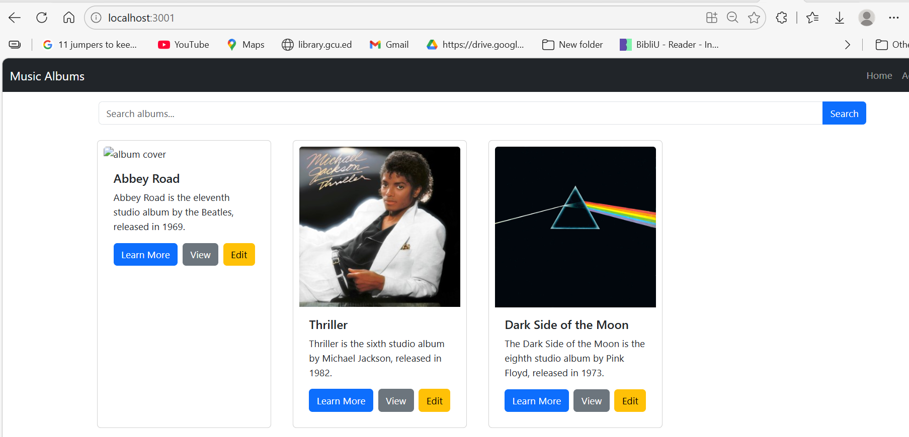
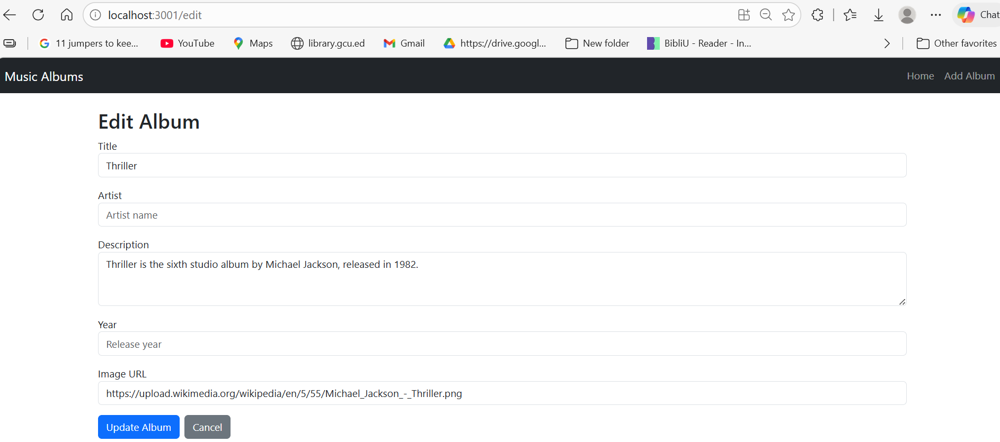
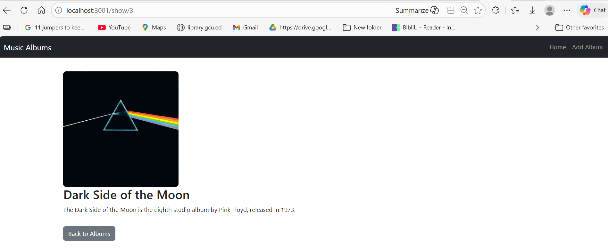

# CST-391 Activity 7 - Dynamic Components & Forms

**Name:** Oluwaseun Akerele    
**Course:** CST-391   
**Activity:** 7

---

## Overview

This activity is a continuation of Activity 6 and focuses on building dynamic React components and data entry forms. It is divided into two parallel tracks:

**Track 1 — Blog Mini App:**   
A standalone React application demonstrating how to dynamically add and remove components from a list using React state, the `.map()` function, controlled components, and the spread syntax.

**Track 2 — Music Application:**                       Continued development of the music album app, including filling in the New Album form (Part 6) and refactoring it into a combined Edit/Create component called EditAlbum (Part 7).

---

## Executive Summary

Activity 7 introduced several key React concepts for building interactive, data-driven applications. The Blog Mini App demonstrated how to manage a dynamic list of components — adding new posts via a controlled textarea and removing posts using the `.filter()` method. This pattern of lifting state to the parent component while passing callbacks down to children is a foundational React design pattern.

In the Music Application, the `NewAlbum.js` component was fully implemented as a controlled form with `useState` hooks for each field. It was then renamed to `EditAlbum.js` and refactored to support both create and edit modes. The component detects its mode by checking whether an `album` prop is present — if so, it pre-fills the form fields for editing; otherwise, it renders a blank form for creating a new album. The REST API uses `POST` for creating and `PUT` for updating, following standard HTTP conventions. Navigation between views is handled by `react-router-dom`'s `useNavigate` hook.

---

## Part 5 — Dynamic Components Demo (Blog Mini App)

### Screenshot 1 - Blog Posts Initial State

` method. The parent App component manages state and the delete callback is passed down to each Post child component.*

---

## Stopping Point #5 Summary

The Blog Mini App demonstrated how to dynamically add and remove components from a React page. Key concepts used:

- **Controlled Component:** A form element whose value is bound to React state and updated on every `onChange` event, keeping the component synchronized with the UI at all times.
- **`.map()`:** Used to render a list of Post components from the `postList` state array. Each element requires a unique `key` prop for React to track changes efficiently.
- **Spread Syntax (`...`):** Used to append a new post to the existing array without mutating state directly: `[...currentList, newPost]`.
- **`.filter()`:** Used to remove a post by returning all items except the one matching the deleted post's ID.
- **Lifting State Up:** The parent `App` component owns the `postList` state and passes `onDelete` and `onAddPost` callbacks down to child components.

---

## Part 6 — Create New Album

### Screenshot 4 - Add New Album Form


*Figure 4: The Add New Album form filled in with details for the Fleetwood Mac album "Rumours". Each field is a controlled component with its own `useState` hook and `onChange` handler.*

### Screenshot 5 - Music App Home



*Figure 5: The Music Albums home page showing all album cards with the new Edit button added alongside the existing View button.*

---

## Stopping Point #6 Summary

The New Album form was implemented as a fully controlled React component. Key concepts used:

- **Controlled Components:** Each form field (`title`, `artist`, `description`, `year`, `imgURL`) has a dedicated `useState` variable and an `onChange` handler that updates state on every keystroke.
- **`useNavigate`:** The `react-router-dom` hook used to programmatically navigate back to the home page after form submission.
- **REST POST:** The form submits data to the backend API using the HTTP `POST` method to create a new album resource.
- **`e.preventDefault()`:** Prevents the default browser form submission behavior, allowing React to handle the submit event.

---

## Part 7 — Edit an Album

### Screenshot 6 - Edit Album Form (Pre-filled)



*Figure 6: The Edit Album form pre-filled with the existing data for the selected album. The form title switches to "Edit Album" and the submit button changes to "Update Album" when in edit mode.*

### Screenshot 7 - View Album



*Figure 7: The single album view showing the album cover image, title, and description. The Back to Albums button uses `useNavigate` to return to the home page.*

---

## Stopping Point #7 Summary

`NewAlbum.js` was renamed to `EditAlbum.js` and refactored to handle both create and edit operations in a single component. Key concepts used:

- **Props-based Mode Switching:** The component checks `album != null` to determine if it is in edit mode. If an album is passed via props, the `useState` hooks initialize with the existing album data, pre-filling the form.
- **PUT vs POST:** In REST API design, `POST` is used to create a new resource and `PUT` is used to update an existing one. `EditAlbum` selects the correct HTTP method based on whether it is in create or edit mode.
- **`selectedAlbum` State:** The parent `App` component stores the selected album in state via `setSelectedAlbum` when the Edit button is clicked, then passes it as a prop to `EditAlbum` through the `/edit` route.
- **Callback Prop Chain:** The `updateSingleAlbum` function flows from `App` → `SearchAlbum` → `AlbumList` → `Card`, demonstrating how callbacks are passed through multiple levels of the component tree.

---

## Deliverables

| Item | Description | Status |
|------|-------------|--------|
| Blog Mini App screenshots | Add, delete, initial state | ✅ |
| Blog App ZIP | `node_modules` removed, folder zipped | ✅ |
| Music App screenshots | Home, View, Edit, Add Album | ✅ |
| Stopping Point #5 summary | Dynamic components paragraph | ✅ |
| Stopping Point #6 summary | New Album form paragraph | ✅ |
| Stopping Point #7 summary | Edit Album paragraph | ✅ |
| Music App ZIP | `node_modules` removed, folder zipped | ✅ |

---

## How to Run

### Blog Mini App
```bash
cd blog
npm install
npm start
# Runs on http://localhost:3000
```

### Music Application
```bash
cd activity7
npm install
npm start
# Runs on http://localhost:3001 (if blog is already on 3000)
```

---

## Key Files Modified in Activity 7

| File | Change |
|------|--------|
| `blog/src/App.js` | New — Blog app root with postList state |
| `blog/src/Post.js` | New — Single post component with Delete button |
| `blog/src/Post.css` | New — Post styling |
| `blog/src/AddPost.js` | New — Controlled textarea form component |
| `src/EditAlbum.js` | Renamed from NewAlbum.js — supports create and edit modes |
| `src/App.js` | Added selectedAlbum state, /edit route, onEditAlbum handler |
| `src/Card.js` | Added Edit button, updated View/Edit to use updateSingleAlbum |
| `src/AlbumList.js` | Updated to pass updateSingleAlbum and full album object to Card |
| `src/SearchAlbum.js` | Updated to pass updateSingleAlbum down to AlbumList |
| `src/OneAlbum.js` | Fixed useParams to use `id` matching route `/show/:id` |

## Lessons Learned

Activity 7 reinforced that controlled components require every form field to have its own `useState` variable and `onChange` handler, giving React full control over form data at all times. The most frequent source of bugs was mismatched field names between the JSON data and component state variables, which caused silent failures where forms rendered but fields appeared blank. Another key lesson was that props must flow through every level of the component tree — missing `updateSingleAlbum` at any single level broke the entire View and Edit functionality. React Router parameter names must also match exactly between the route definition and `useParams()`, as a mismatch produces undefined values with no compiler warning. Finally, combining New and Edit album functionality into a single `EditAlbum` component demonstrated the DRY principle in practice — one bug fix or feature update applies to both create and edit modes simultaneously.

---

## Conclusion

Activity 7 successfully demonstrated the power of dynamic React components and controlled forms. The Blog Mini App provided a focused environment to understand the core patterns — managing a list in state, rendering with `.map()`, removing items with `.filter()`, and adding items with spread syntax. These same patterns transferred directly into the Music Application's create and edit album features. The most significant achievement was the `EditAlbum` component, which handles both creating and editing albums by checking for the presence of an `album` prop — a clean, reusable design that avoids code duplication. The activity reinforced that consistent data modeling across JSON, component state, and API payloads is essential. Next steps would include connecting to a live REST API for data persistence, adding form validation with user feedback, and using React Context to eliminate prop drilling across the component tree.