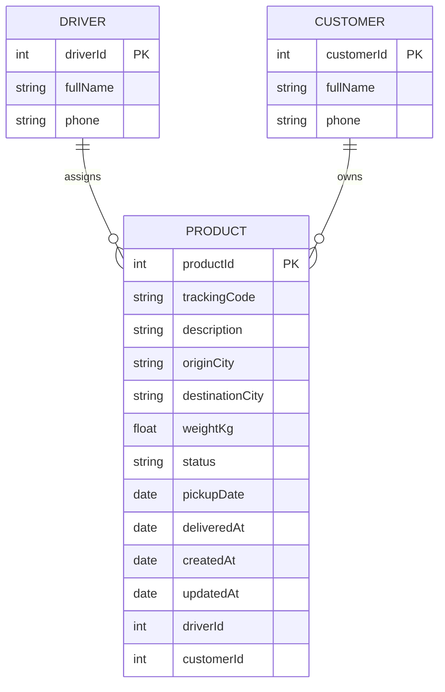
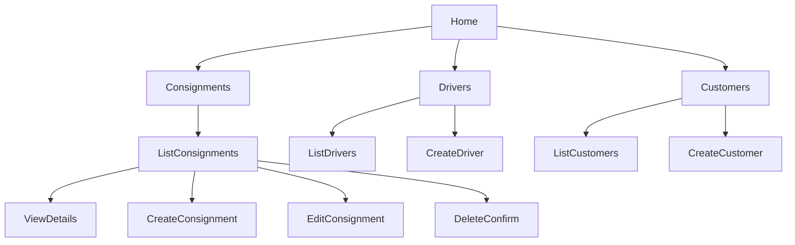

# SAMOPEL LOGISTICS DISPATCH HUB  
## CST 391 – MILESTONE 2 PROJECT PROPOSAL (REFINED)

---

## INSTRUCTOR FEEDBACK

> “Oluwaseun, this is fine for this week, however, would be better if in Markdown. If you get time you can easily copy the docx file and put in a README.md and reference the screenshots, very easy to do. Thank You.”

### HOW THE FEEDBACK WAS ADDRESSED

The original Milestone 1 proposal has been fully converted from Microsoft Word format into Markdown.  
The document structure has been refined, tables have been added where appropriate, and diagrams are now represented using Mermaid syntax to support direct rendering in GitHub and VS Code.

All design artifacts remain organized within the repository and are referenced consistently.

---

## INTRODUCTION

**Samopel Logistics Dispatch Hub** is a logistics web application designed to help Samopel Logistic LLC track and manage delivery consignments from pickup through final delivery.

The system manages consignments, referred to as products within the application. Each consignment includes a unique tracking code, shipment details, delivery status, assigned driver, and customer information.

The application will be implemented with a single Express and NodeJS REST API connected to a MySQL database. Two separate front end clients will be developed using Angular and React. Both clients will communicate with the same API to ensure consistent business logic and data access.

---

## EXECUTIVE SUMMARY

This project proposes the design and development of a logistics dispatch management system that supports full **CRUD** operations for delivery consignments. The system emphasizes clean architecture, **RESTful API** design, and reusable backend services.

**Milestone 2** refines the initial proposal by formalizing REST API endpoints, improving documentation structure, and introducing diagram definitions using Mermaid. The project is structured to support incremental development across upcoming milestones while maintaining clarity, scalability, and consistency across both front end implementations.

---

## FUNCTIONALITY REQUIREMENTS (USER STORIES)

| ID | User Story |
|---|---|
| US-1 | As a dispatcher, I want to create a new consignment so I can register a package for delivery. |
| US-2 | As a dispatcher, I want to view a list of consignments so I can monitor delivery progress. |
| US-3 | As a dispatcher, I want to view consignment details so I can see all shipment information in one place. |
| US-4 | As a dispatcher, I want to update a consignment so I can correct destination or status information. |
| US-5 | As a dispatcher, I want to delete a consignment so I can remove cancelled or test records. |
| US-6 | As a dispatcher, I want to search consignments by tracking code so I can find records quickly. |
| US-7 | As a dispatcher, I want to filter consignments by status so I can focus on active deliveries. |
| US-8 | As a dispatcher, I want to assign a driver to a consignment so delivery responsibility is tracked. |
| US-9 | As a dispatcher, I want to record a delivery date when a consignment is completed. |

---

## INITIAL DATABASE DESIGN

The application uses a MySQL relational database.  
The primary entity is **Product**, which represents a consignment.

### DATA TYPES USED

| Type | Purpose |
|---|---|
| INT | Primary and foreign keys |
| VARCHAR | Textual fields such as names and cities |
| DECIMAL | Shipment weight |
| DATE | Pickup date |
| DATETIME | Delivery and audit timestamps |

### ER DIAGRAM (MERMAID)

## DATABASE DESIGN NOTES

| Field        | Description                                         |
|--------------|-----------------------------------------------------|
| trackingCode | Unique identifier for searching consignments        |
| status       | Pending, In Transit, Delivered, or Cancelled        |
| deliveredAt  | Nullable until delivery is completed                |

These fields support efficient tracking, status monitoring, and delivery auditing within the logistics workflow.

## INITIAL UI SITEMAP

Both Angular and React clients follow the same navigation structure.

## INITIAL UI WIREFRAMES

Low fidelity wireframes were created to define layout and interaction flow. These wireframes focus on structure, navigation, and user interaction rather than final visual styling.

| Screen | Description|
|---|---|
|Consignment List |Search, filter, and table view |
|Consignment Form  |	Create and edit consignments |
| Consignment Details	| View shipment details |

## Wireframe References

- [Consignment List](doc/wireframes/consignment-list.png)
- [Consignment Form](doc/wireframes/consignment-form.png)
- [Consignment Details](doc/wireframes/consignment-details.png)

## REST API DESIGN

The Samopel Logistics Dispatch Hub exposes a RESTful API that provides access to consignment resources.
All endpoints follow REST conventions using plural resource names and standard HTTP verbs.

| Method | Endpoint | Description |
|------|---------|-------------|
| GET | /api/products | Retrieve all consignments |
| GET | /api/products/{id} | Retrieve a specific consignment by ID |
| POST | /api/products | Create a new consignment |
| PUT | /api/products/{id} | Update an existing consignment |
| DELETE | /api/products/{id} | Delete a consignment |

Each endpoint returns JSON responses and is consumed by both Angular and React front end clients.

## RISKS AND UNKNOWNS

| Risk | Description |
|----|-------------|
| Environment Setup | Dependency versions and tooling configuration may delay setup |
| Database Connectivity | Authentication and connection issues with MySQL |
| Scope Control | Risk of feature creep in logistics workflows |
| Dual Front Ends | Maintaining consistency between Angular and React clients |
| Data Validation | Ensuring consistent and accurate shipment data |

## REPOSITORY

认为GitHub Repository:
https://github.com/SEUN-09/cst391
