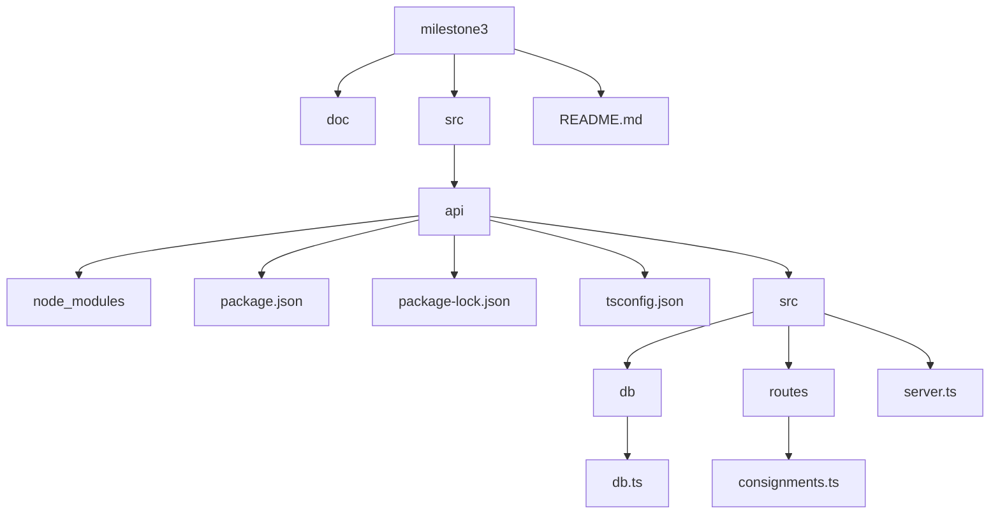
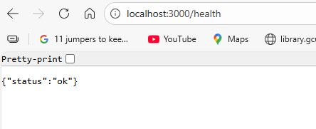
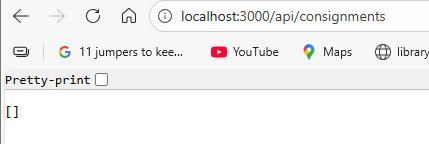
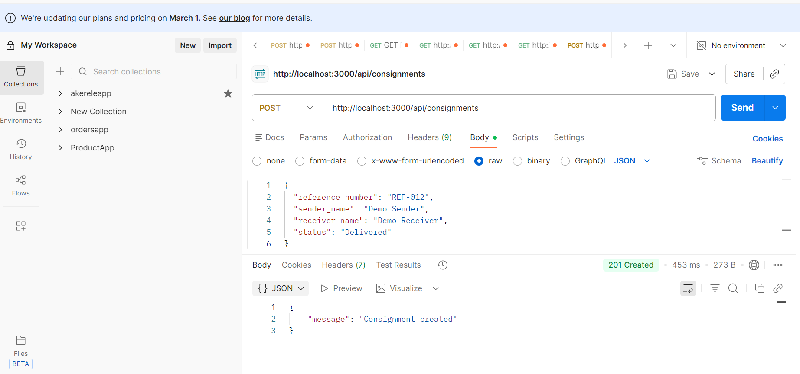
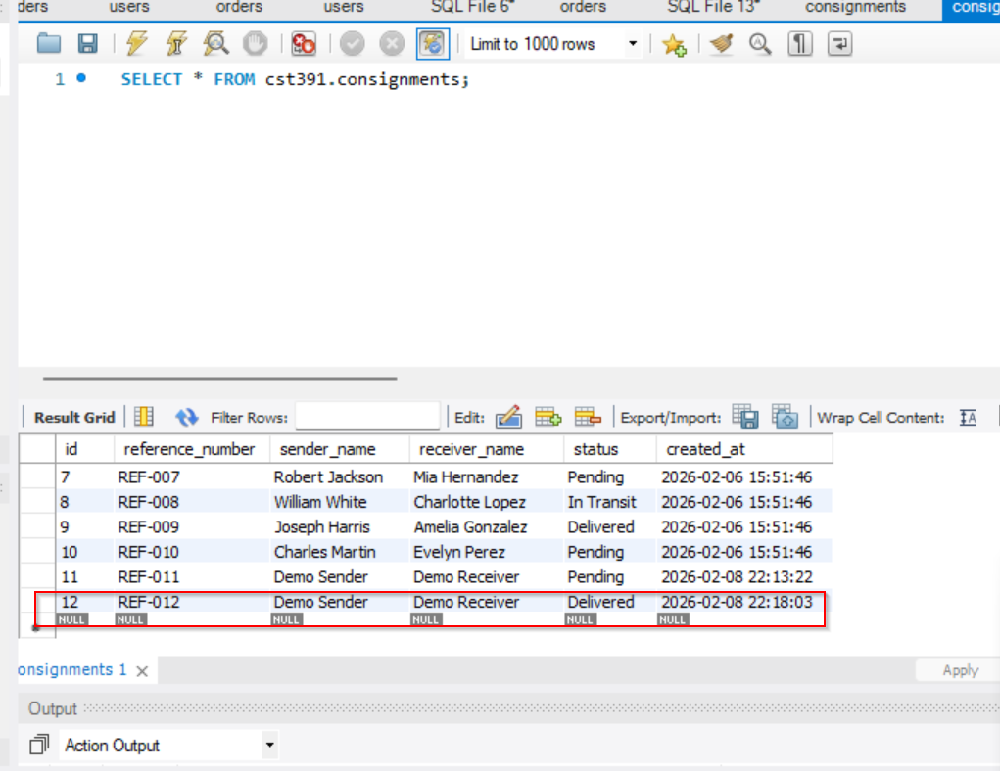

# CST-391 – Milestone 3: Backend REST API (Express + TypeScript + MySQL)

## Overview

This milestone focuses on the design and implementation of back-end REST APIs using the Express and NodeJS frameworks with TypeScript. A relational MySQL database is used for persistent data storage. The APIs are anonymous and support core CRUD operations. Postman is employed to test and validate all API endpoints.

The domain model implemented for this milestone is **Consignments**, which aligns with the design proposed in earlier milestones.

---
## Executive Summary

This milestone demonstrates the design and implementation of backend REST APIs using the Express and NodeJS frameworks with TypeScript. The primary objective is to build a functional backend service connected to a relational MySQL database that supports core Create, Read, Update, and Delete (CRUD) operations.

The solution implements RESTful endpoints for managing consignment records. The application follows a modular structure, separating server configuration, routing, and database access logic. A MySQL database is used for persistent storage, and all database interactions are performed through parameterized queries.

API endpoints are tested using Postman, and database modifications are verified through subsequent read operations and direct queries executed in MySQL Workbench. A health check endpoint is also included to confirm server availability.

This milestone establishes a stable backend foundation that can be extended with additional functionality, documentation, and presentation components in later milestones.


## Technologies Used

- NodeJS
- Express
- TypeScript
- MySQL
- mysql2 (promise-based driver)
- Postman
- MySQL Workbench

---

## Project Structure



---

## Database Design

A MySQL database named `cst391` is used with the following table:

### Table: consignments

| Column Name        | Type            | Description                     |
|--------------------|-----------------|---------------------------------|
| id                 | INT (PK, Auto)  | Unique identifier               |
| reference_number   | VARCHAR(50)     | Consignment reference number    |
| sender_name        | VARCHAR(100)    | Name of sender                  |
| receiver_name      | VARCHAR(100)    | Name of receiver                |
| status             | VARCHAR(50)     | Shipment status                 |
| created_at         | TIMESTAMP       | Record creation timestamp       |

---

## Implemented API Endpoints

### Health Check

**GET** `/health`

Used to confirm that the Express server is running.

**Response**
**Screenshot**


## Example: Consignments GET endpoint screenshot

## Read All Consignments

**GET** `/api/consignments`

Returns all consignments stored in the database.

**Screenshot**




## Create Consignment

**POST** `/api/consignments`  
Creates a new consignment record using JSON input.

**Example Request Body**
```json
{
  "reference_number": "REF-012",
  "sender_name": "Screencast Sender",
  "receiver_name": "Screencast Receiver",
  "status": "Delivered"
}
```
### Postman Testing




### MySQL Workbench Verification



## Screencast Demonstration

A complete functional demonstration of the application is available at the link below.

🔗 **Screencast (Loom)**  
https://www.loom.com/share/4881f7204bd44edc825e1d1ff3c4eaa8

## Project PowerPoint

The project presentation for this milestone is available at the link below.

📊 **Project PowerPoint (PPTX)**  
[Download the presentation](doc/CST-391_Milestone_Presentation.pptx)


## Risks and Unknowns

While the backend REST API is fully functional for the scope of this milestone, there are several risks and unknowns that may impact future development. Input validation is currently minimal and could be expanded to prevent malformed or incomplete requests from reaching the database. Additional error handling may be required to gracefully manage database connection failures or unexpected runtime errors.

Scalability has not been evaluated at this stage, and performance under high request volume remains unknown. Authentication and authorization are not implemented, which may introduce security risks if the application is extended beyond an academic environment. Finally, future integration with a front end or external services may require adjustments to the API contract and database schema.

---

## Conclusion

Milestone 3 successfully demonstrates the design and implementation of a backend REST API using Express, TypeScript, and a MySQL relational database. The application supports full CRUD operations for consignment records and adheres to RESTful design principles. API functionality was tested using Postman, and all database modifications were verified using MySQL Workbench.

This milestone establishes a solid backend foundation for subsequent milestones, including enhanced validation, testing, documentation, and presentation requirements. The current implementation meets all assignment objectives and provides a maintainable structure for future expansion.
