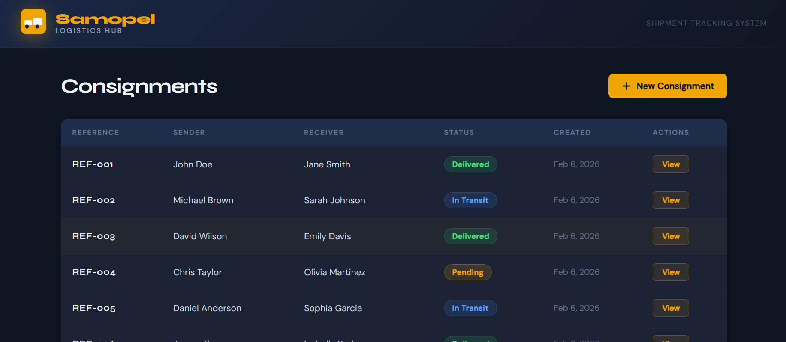
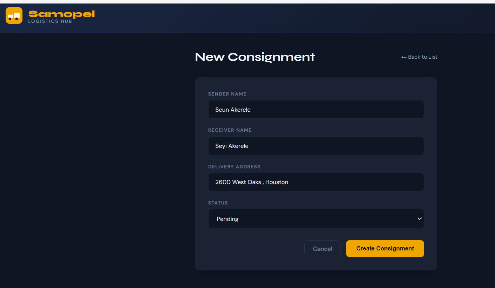
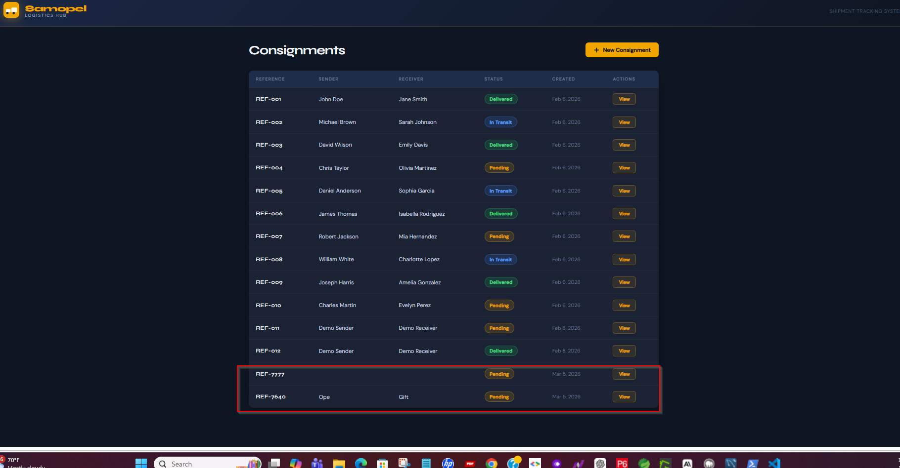
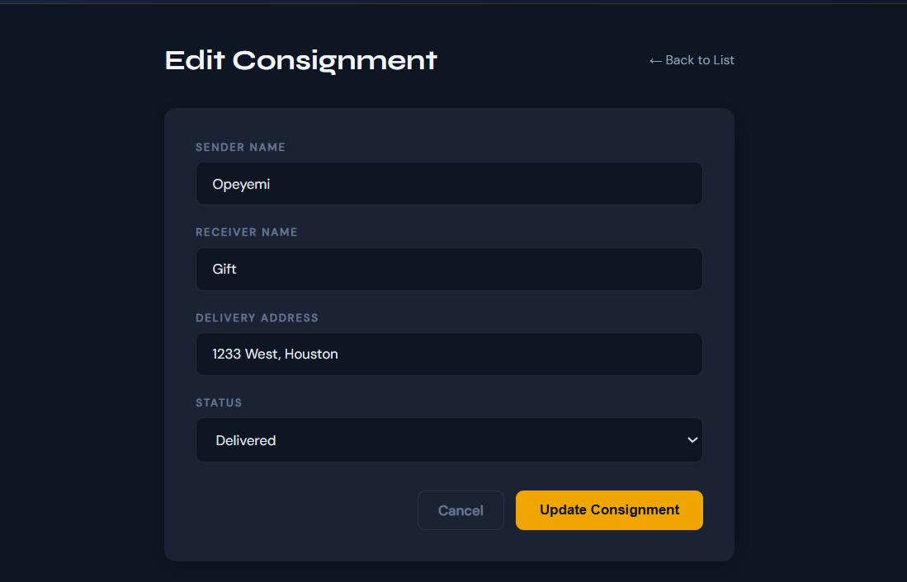
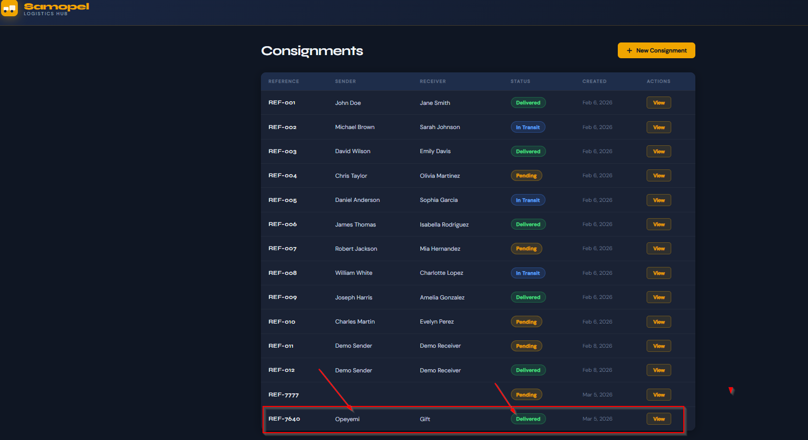

# Samopel Logistics Hub — Design Report

**Course:** CST391 — JavaScript Web Application Development
**Milestone:** 4 — Angular Front-End Application
**Application:** Samopel Logistics Hub (Consignment Tracking System)

---

## 1. Overview

Samopel Logistics Hub is a full-stack web application built to manage consignment (shipment) records. The system allows logistics staff to track packages from creation through delivery, providing full visibility into sender, receiver, delivery address, and current shipment status.

The application is composed of two layers:

- **Back-End:** A Node.js/Express REST API connected to a MySQL database, running on port 3000.
- **Front-End:** An Angular 17 standalone component application running on port 4200, consuming the REST API via Angular's `HttpClient`.

---

## 2. Executive Summary

This milestone delivers a fully functional Angular front-end application integrated with the REST API developed in Milestone 3. The application implements complete CRUD (Create, Read, Update, Delete) operations on consignment records, with a polished, dark-themed UI branded as "Samopel Logistics Hub."

## Presentation

[📊 View Milestone 4 PowerPoint](Doc/Milestone4_powerpoint.pptx)

Key achievements in this milestone:

- All five CRUD operations are functional end-to-end through the UI.
- The Angular application communicates directly with the Express REST API on `localhost:3000`.
- Status badges are color-coded (green for Delivered, blue for In Transit, amber for Pending).
- The application includes consistent branding, navigation, and responsive layout across all pages.
- Angular standalone components are used throughout, following modern Angular 17 best practices.

---

## 3. Application Architecture

```
milestone4/
├── api/                        # Express REST API (Node.js)
│   ├── server.js               # API routes and MySQL connection
│   └── package.json
└── consignment.ui/             # Angular front-end application
    └── src/
        └── app/
            ├── core/
            │   └── services/
            │       └── consignments.service.ts   # HTTP service layer
            └── pages/
                └── consignments/
                    ├── consignment-list/         # List all consignments
                    ├── consignment-details/      # View single consignment
                    └── consignment-form/         # Create and Edit form
```

### Technology Stack

| Layer | Technology | Version |
|---|---|---|
| Front-End Framework | Angular | 17 |
| Styling | Custom CSS + Google Fonts | — |
| HTTP Client | Angular HttpClient | Built-in |
| Back-End | Node.js + Express | 18 / 4.x |
| Database | MySQL | 8.x |
| ORM/Driver | mysql2 | Latest |

---

## 4. REST API Documentation

Base URL: `http://localhost:3000`

All endpoints consume and produce `application/json`.

### Endpoints

| Method | Endpoint | Description | Request Body | Response |
|---|---|---|---|---|
| GET | `/consignments` | List all consignments | None | Array of Consignment objects |
| GET | `/consignments/:id` | Get single consignment by reference number | None | Single Consignment object |
| POST | `/consignments` | Create new consignment | `{ sender_name, receiver_name, status, delivery_address }` | `{ reference_number, message }` |
| PUT | `/consignments/:id` | Update existing consignment | `{ sender_name, receiver_name, status, delivery_address }` | `{ message }` |
| DELETE | `/consignments/:id` | Delete consignment by reference number | None | `{ message }` |

### Consignment Object Schema

```json
{
  "reference_number": "REF-001",
  "sender_name": "John Doe",
  "receiver_name": "Jane Smith",
  "status": "Delivered",
  "delivery_address": "123 Main St, Phoenix AZ",
  "created_at": "2026-02-06T21:51:46.000Z"
}
```

### Status Values

| Value | Description |
|---|---|
| `Pending` | Consignment created, not yet shipped |
| `In Transit` | Consignment currently being transported |
| `Delivered` | Consignment successfully delivered |

### Example: Create Consignment

**Request**
```
POST http://localhost:3000/consignments
Content-Type: application/json

{
  "sender_name": "Alice Johnson",
  "receiver_name": "Bob Williams",
  "status": "Pending",
  "delivery_address": "456 Oak Ave, Tempe AZ"
}
```

**Response**
```json
{
  "reference_number": "REF-4821",
  "message": "Created"
}
```

---

## 5. Angular Application Pages

### 5.1 Consignment List (`/consignments`)
### Consignment List


Displays all consignments in a styled table with color-coded status badges. Provides a "New Consignment" button and a "View" link for each row.

**Component:** `ConsignmentListComponent`
**API Call:** `GET /consignments`

### 5.2 Consignment Details (`/consignments/:id`)
### Consignment Detail


Displays full details of a single consignment. Provides "Edit Consignment" and "Delete" action buttons.

**Component:** `ConsignmentDetailsComponent`
**API Call:** `GET /consignments/:id`
### Create Consignment


### 5.3 Create / Edit Form (`/consignments/new`, `/consignments/:id/edit`)
### Created Consignment


### Edit Consignment




A shared form component that handles both creating new consignments and editing existing ones. The form detects edit mode via the route parameter.

**Component:** `ConsignmentFormComponent`
**API Calls:** `POST /consignments` (create), `PUT /consignments/:id` (edit)

---

## 6. Design Updates & Known Issues

### Design Updates Summary

| Area | Update | Notes |
|---|---|---|
| Branding | Added Samopel Logistics Hub logo and header | Consistent across all pages |
| Status Display | Color-coded badge system | Green=Delivered, Blue=In Transit, Amber=Pending |
| API URL | Changed from `/api/consignments` to `/localhost:3000/consignments` | Proxy config replaced with direct URL |
| Route Fix | Fixed Create route from `/consignments/create` to `/consignments/new` | Matched app.routes.ts |
| Edit Mode | Form component reused for both Create and Edit | `isEditMode` flag detects context |
| Cache Busting | Added `?t=${Date.now()}` to GET requests | Fixes 304 Not Modified issue |
| Change Detection | Added `ChangeDetectorRef.detectChanges()` | Fixes delayed render after subscribe |

### Known Issues / TO DO Items

| Issue | Severity | Status |
|---|---|---|
| No form validation (empty fields allowed) | Medium | TO DO |
| Reference numbers auto-generated randomly (no sequence) | Low | TO DO |
| No authentication or access control | High | Out of scope for this milestone |
| Dates display in UTC (not local timezone) | Low | TO DO |
| No pagination on consignment list | Low | TO DO |

---

## 7. Application Navigation

```
/ → redirects to /consignments
/consignments              → Consignment List
/consignments/new          → Create New Consignment
/consignments/:id          → Consignment Details (Read)
/consignments/:id/edit     → Edit Consignment (Update)
```

---
## Screencast Demo

### Samopel Logistics Hub — Milestone 4 Demo
https://www.loom.com/share/4abc7e14aed8422a8ea67860b1c4148b

> Click the image above to watch the full demo on Loom.

**Demo covers:**
- Application navigation
- List all consignments (READ ALL)
- View consignment details (READ)
- Create new consignment (CREATE)
- Edit existing consignment (UPDATE)
- Delete consignment (DELETE)

## 8. Setup & Running Instructions

### Prerequisites

- Node.js 18+
- MySQL 8.x running locally
- Angular CLI (`npm install -g @angular/cli`)

### Start the API

```bash
cd milestone4/api
npm install
node server.js
# Server running on port 3000
```

### Start the Angular App

```bash
cd milestone4/consignment.ui
npm install
ng serve
# Application running at http://localhost:4200
```

### Database

Database: `cst391`
Table: `consignments`

```sql
CREATE TABLE consignments (
  reference_number VARCHAR(20) PRIMARY KEY,
  sender_name VARCHAR(100),
  receiver_name VARCHAR(100),
  status VARCHAR(50),
  delivery_address VARCHAR(255),
  created_at TIMESTAMP DEFAULT CURRENT_TIMESTAMP
);
```

---

## 9. Lessons Learned

- **Angular Proxy Config** — The proxy configuration only applies when explicitly set in `angular.json` under the development configuration. When in doubt, using a hardcoded full URL is more reliable for local development.
- **304 Not Modified** — Angular's `HttpClient` respects browser cache headers. Adding a cache-busting query parameter (`?t=Date.now()`) ensures fresh data is always fetched.
- **Standalone Components** — Angular 17's standalone component model requires explicit imports of `CommonModule`, `RouterModule`, and `FormsModule` in each component rather than relying on a shared `AppModule`.
- **Change Detection** — In some cases, Angular does not automatically detect changes after async operations. Injecting `ChangeDetectorRef` and calling `detectChanges()` after data loads ensures the view updates immediately.

---

*Samopel Logistics Hub — CST391 Milestone 4*
