# Milestone 5 — Samopel Consignment Tracking System

**Student:** Oluwaseun Akerele  
 **Course:** CST391         
**Date:** March 2026

---

## Overview

This repository contains Milestone 5 of the Samopel Consignment Tracking System — a full-stack web application built for a logistics company to manage shipment records. This milestone introduces a **React front-end** integrated with the existing **Express/Node.js REST API** and **MySQL database** from Milestone 4.

The application supports full **CRUD operations** (Create, Read, Update, Delete) on consignment records, featuring a dark-themed UI consistent with the original Angular design from Milestone 4.

| Item | Detail |
|---|---|
| **Front-end** | React 18 (Create React App) |
| **Routing** | React Router v6 |
| **HTTP Client** | Axios |
| **Back-end** | Express.js + Node.js |
| **Database** | MySQL (cst391 schema) |
| **Ports** | React: 3001 · API: 3000 · MySQL: 3306 |

## 🎬 Screencast

[▶ Click to Watch Milestone 5 Demo](./screencast/The-screencast.mp4)
---

## Executive Summary

Milestone 5 transitions the presentation layer from Angular (Milestone 4) to React while preserving the full functionality, API design, and visual theme of the previous milestone. The development process involved:

- Scaffolding a new React application using Create React App
- Building four functional components: `NavBar`, `ConsignmentList`, `ConsignmentDetail`, and `ConsignmentForm`
- Creating a centralized `consignmentService.js` using Axios for all API communication
- Implementing React Router v6 for client-side navigation across five routes
- Resolving MySQL authentication issues and database schema alignment between the API and front-end
- Enabling CORS on the Express server to allow cross-origin requests from React

All CRUD operations were verified as functional. The app loads, creates, reads, updates, and deletes consignment records from the live MySQL database.

---

## System Architecture

### Three-Tier Architecture

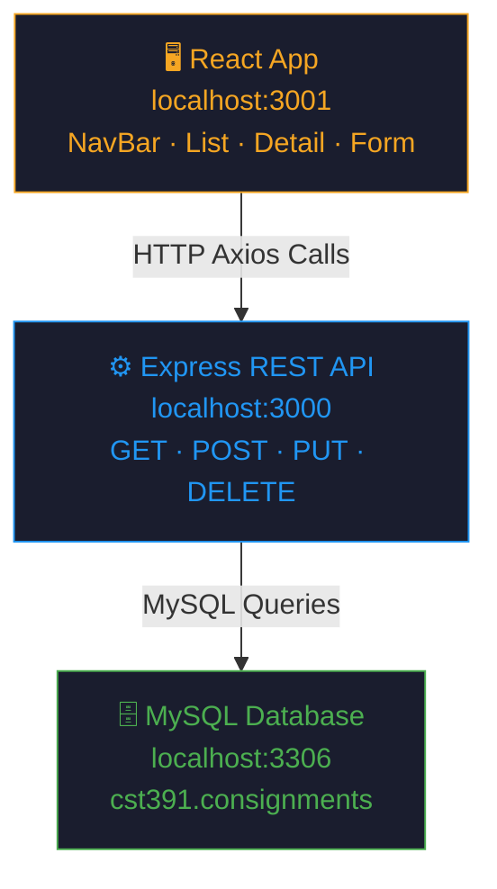

### React Component Tree

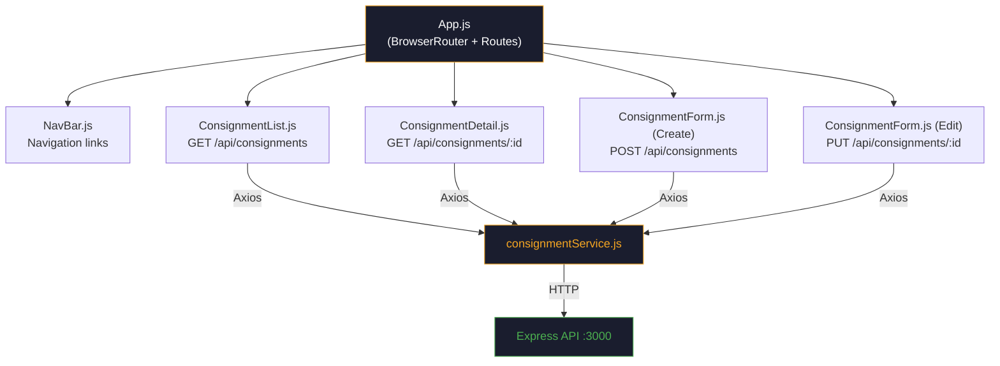

### Routing Map

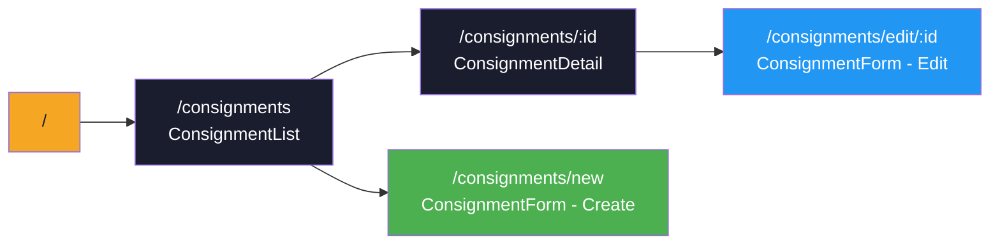

### Database Schema

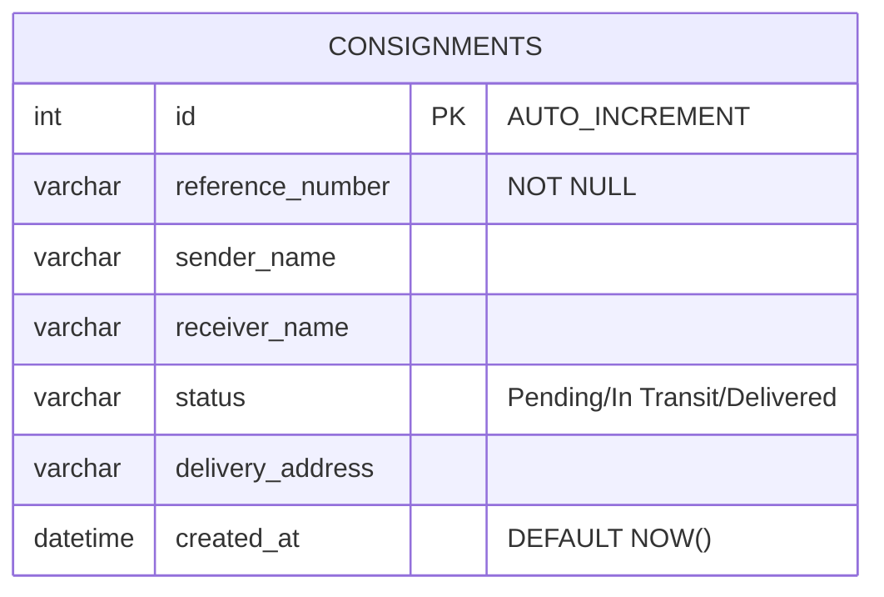

### REST API Flow

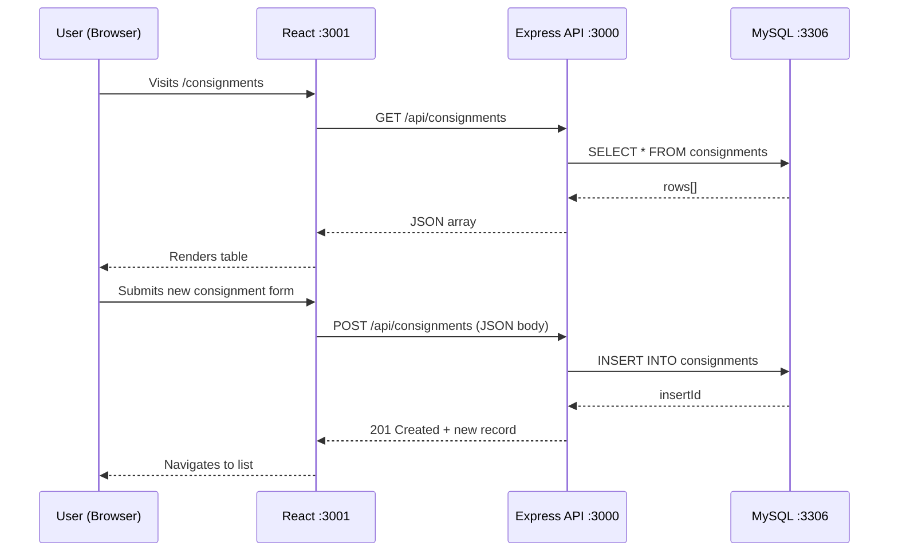

---

## Application Screenshots

### Project File Structure

The milestone 5 folder contains two sub-projects: the Express API and the React front-end.

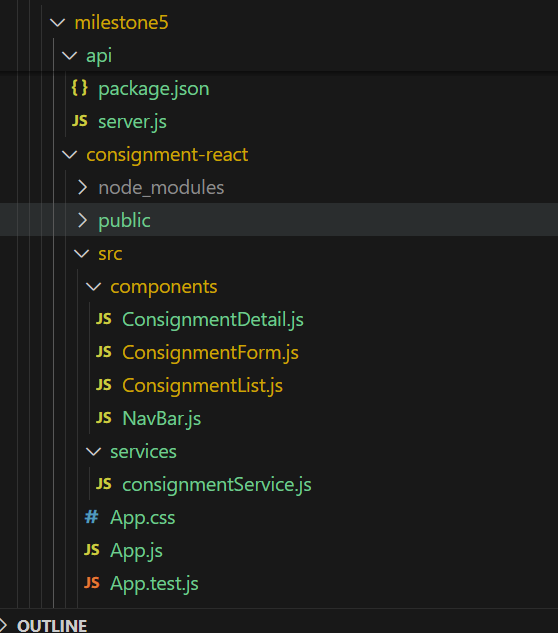

*VS Code file explorer showing `milestone5/` with the `api/` and `consignment-react/src/` folders including `components/` and `services/`.*

---

### MySQL Database — Consignments Table

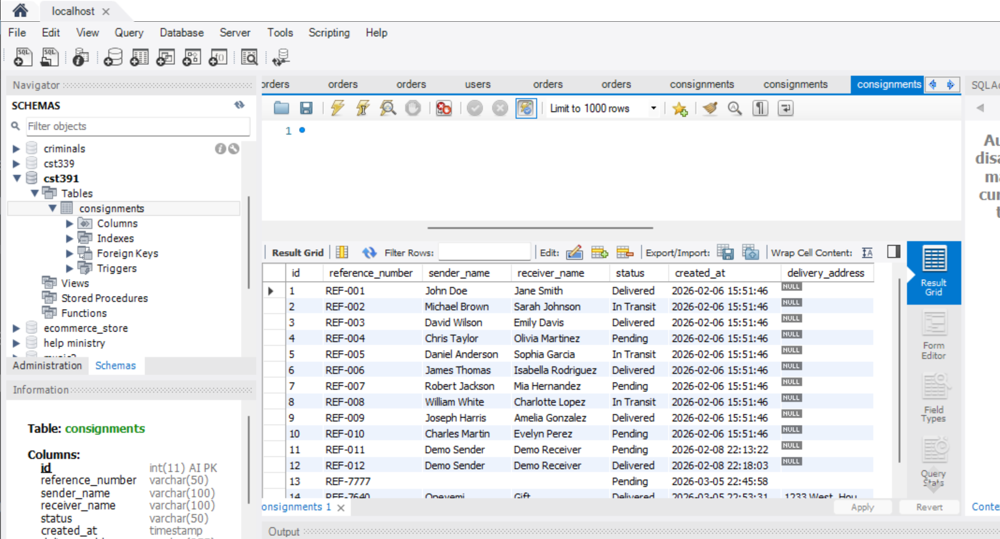

*The `cst391.consignments` table in MySQL Workbench showing seed data with reference numbers REF-001 through REF-010. This is the live data source for the React app.*

---

### API Server Running

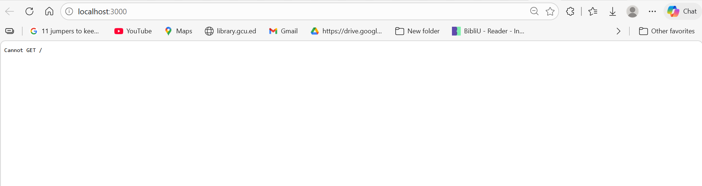

*`localhost:3000` returns "Cannot GET /" confirming the Express API server is live and running. The API only responds to `/api/consignments` routes, so this is expected and correct.*

---

### Consignment List — READ

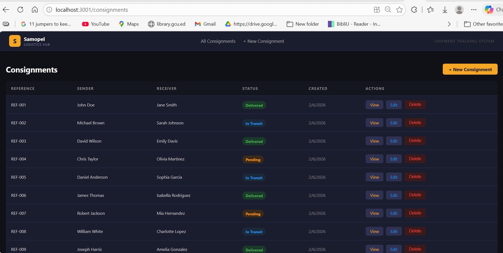

*The main list view at `localhost:3001/consignments` displays all records from MySQL. Each row shows the reference number, sender, receiver, color-coded status badge (Delivered / In Transit / Pending), creation date, and View / Edit / Delete action buttons.*

---

### New Consignment Form — CREATE

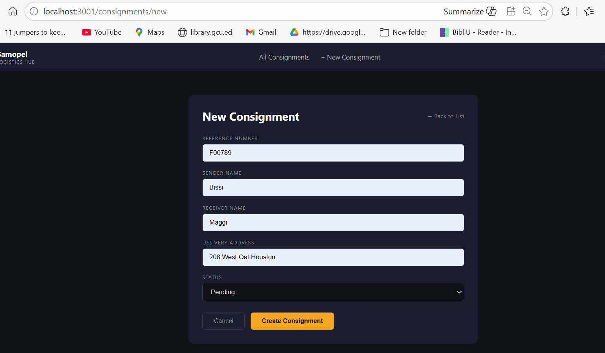

*The create form at `localhost:3001/consignments/new` allows the user to enter a reference number, sender name, receiver name, delivery address, and status. Submits via Axios POST to the Express API.*

---

### Newly Created Record — CREATE Result

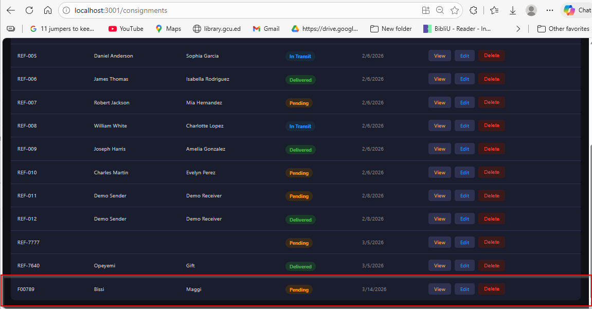

*After submitting the create form, the new consignment record appears in the list, confirming the POST request was successful and the database was updated.*

---

### Consignment Detail — READ Single Record

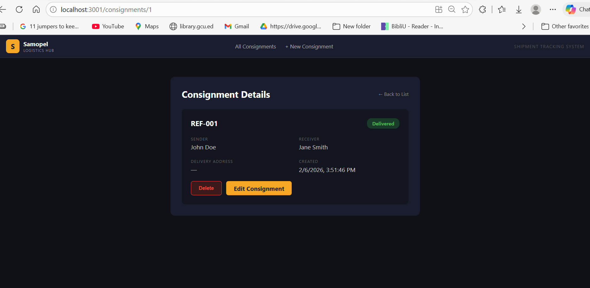

*The detail card at `localhost:3001/consignments/:id` shows all fields for a single consignment including the color-coded status badge, sender/receiver grid, delivery address, and action buttons for Edit and Delete.*

---

### Delete Confirmation — DELETE

*The delete operation triggers a browser confirmation dialog. On confirm, Axios sends a DELETE request to the API and the record is removed from the list instantly.*

---

### Record Marked for Deletion — DELETE Result

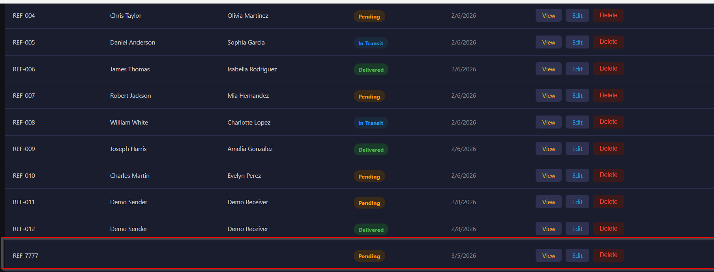

*Before and after state showing the targeted record being removed from the consignment list after the DELETE operation completes successfully.*

---

## Known Issues & Future Enhancements

| # | Issue / Enhancement | Severity | Status | Notes |
|---|---|---|---|---|
| 1 | Manual reference number entry | Medium | Open | No auto-generation or uniqueness check |
| 2 | No live form validation feedback | Medium | Open | Only HTML5 `required` attribute used |
| 3 | No user authentication | Low | Out of scope | All CRUD is publicly accessible |
| 4 | No pagination | Low | Open | All records load at once — may slow with large datasets |
| 5 | No search or filter | Low | Open | Users must scroll the full list to find records |
| 6 | No confirmation on edit navigation | Low | Open | Unsaved changes are lost without warning |
| 7 | `created_at` not set on update | Low | Open | PUT request does not refresh the timestamp |

---

## Lessons Learned

### 1. Schema Alignment Is Critical
The front-end field names must exactly match the database column names. The initial components used `productName`, `category`, and `price` — which were wrong for this project's schema (`reference_number`, `sender_name`, `receiver_name`). This caused silent CRUD failures that required a full component refactor.

**Takeaway:** Always inspect the actual database schema before writing front-end components.

---

### 2. CORS Must Be Enabled Before Testing
Running React on port 3001 and Express on port 3000 triggers browser CORS blocking by default. Adding `cors` middleware to the Express server must be one of the very first setup steps — not an afterthought when API calls start failing.

**Takeaway:** Add `app.use(cors())` immediately when building a split front-end/back-end project.

---

### 3. Development Environment Matters
Bash commands like `&&` and `touch` do not work in Windows PowerShell. This caused confusion during project setup. Switching to PowerShell-native equivalents (`;` separator and `New-Item`) resolved the issue.

**Takeaway:** Know your terminal. Always verify shell-specific syntax when following tutorials written for a different OS.

---

### 4. React's Component Model Aligns with Backend Thinking
React's modular, reusable component structure felt natural coming from a backend development perspective. The idea of a service layer (`consignmentService.js`) mirrors backend patterns like repository or service classes.

**Takeaway:** Front-end frameworks are more approachable for backend developers than expected — the mental models overlap significantly.

---

### 5. Understanding the Front-End Improves API Design
Seeing how Axios consumes each endpoint made the API design clearer. For example, understanding that the React form submits JSON directly shaped how the Express routes parse `req.body`.

**Takeaway:** Building the front-end and back-end in the same project — even sequentially — produces better API contracts.

---

### 6. Visual Consistency Reduces Migration Risk
Preserving the Milestone 4 dark theme and component structure in React reduced design decisions during migration. Having a clear visual reference accelerated development and made it easy to verify correctness.

**Takeaway:** Establish a UI baseline early. Consistent design across milestones makes iterative development faster and reduces QA scope.

---

## Conclusion

Milestone 5 successfully delivers a fully functional React front-end for the Samopel Consignment Tracking System. All five CRUD operations are implemented and verified against a live MySQL database through the Express REST API. The application preserves the dark theme, Samopel branding, and component structure established in Milestone 4, demonstrating that a front-end framework migration can be completed without disrupting the underlying API or data layer.

The primary challenges — MySQL credential errors, schema misalignment, CORS configuration, and PowerShell compatibility — were resolved systematically and each produced a concrete lesson applicable to future full-stack web development projects.

The codebase is structured cleanly with separated concerns: routing in `App.js`, UI in `components/`, and API communication in `services/`. This separation sets a strong foundation for Milestone 6 testing and the final benchmark presentation.

---

*Samopel Consignment Tracking System · CST391 · Oluwaseun Akerele · March 2026*
